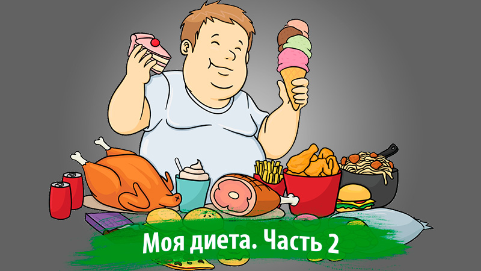

+++
title = "Начинаем худеть! Моя диета и меню. Часть 2"
date = 2020-11-16T00:01:56+03:00
tags = ["диета"]
description = "В этом посте вы узнаете, как начать худеть, используя полученные знания из предыдущих постов. Но сначала давайте я расскажу о своем текущем телосложении."
draft = false
+++

В предыдущих постах мы выяснили, что же нужно делать, чтобы начать худеть и сбрасывать лишние килограммы уже сейчас без применения химических или других медикаментозных средств. В этом посте вы узнаете, как начать худеть, используя полученные знания из предыдущих постов. Но сначала давайте я расскажу о своем текущем телосложении.

## Мое телосложение. Стоит ли худеть?

Мой текущий вес составляет 90 кг, а рост 182 см, а это значит, что у меня предожирение. Мой нормальный вес не должен превышать 80 кг, в идеале он должен быть 75 кг. По типу телосложения я — мезоморф, близкий к эктоморфу. Это значит, что у меня должен быть средний или низкий подкожный слой жира и высокий метаболизм. Но из-за несбалансированного питания и неправильного образа жизни стал расти живот и отвисать бока, появился второй подбородок. Когда я смотрел на себя в зеркало, возникало чувство неприязни и отвращения от выпирающего пуза. Отражение в зеркале уже как бы кричало мне:

*– Ну что, жирная свинья? Когда ты уже избавишься от этого ненавистного пуза? Или так и будешь всё время ходить как беременный гусь?*

*– Ну уже нет, хватит с меня этого дерьма! Начну худеть.*

И я побежал взвешиваться. К слову сказать, я думал, что вешу около 100 кг. Но это уже было неважно. Цель была сразу поставлена. К слову сказать, и время было выбрано самое подходящее – лето. Тут тебе и большой выбор фруктов и овощей, и цены на них не такие высокие как в другое время года, и жаркая температура способствует более интенсивному сжиганию калорий, и море теплое – можно заняться активно плаванием во время отпуска или по выходным. Так всё и началось.

> **Цель минимум – похудеть до 80 кг, цель максимум – до 75 кг**

## Неделя 1. Уменьшаем количество потребляемой пищи

Итак, начинаем наш процесс похудения. Самое сложное – начать худеть и не сорваться психологически. Уменьшаем количество потребляемой пищи или разбиваем весь объем на мелкие порции, если сложно сразу это сделать. Я решил всё урезать сразу. У меня ещё было странное вздутие живота от салата (скорее всего реакция на масло) в самом начале, поэтому есть как обычно было уже проблематично. Собственно, я урезал количество потребляемой пищи вдвое, стал больше пить чистой воды, отказался от мучных и кондитерских изделий, сахара, пива, чипсов и пр. дерьма. Чем меньше мы привыкнем есть, тем меньше будет требовать наш желудок и тем меньше он будет становиться. В итоге, к концу недели мой вес уже составил 88,7 кг. Неплохой результат.

## Неделя 2. Составляем диетическое меню

Однако, ограничением количества пищи особых результатов не добьешься. Надо ещё и составить свое диетическое меню и ещё значительнее уменьшить количество потребляемых калорий. Меньше жрать – это конечно хорошее решение, но недостаточное. Я не сторонник голодания и думаю, что это не совсем здоровая вещь, потому что есть надо в любом случае, иначе потом могут быть проблемы со здоровьем и общим функционированием организма. Меню я себе составил следующее.

8:00. Одно вареное яйцо всмятку или вкрутую, один любой фрукт (банан, яблоко и т.п.), стакан чистой воды. Можно и чай, но обязательно без сахара и прочего сладкого.

11:00. Овощ или фрукт (огурец или яблоко). Или два, если есть охота.

13:00. Обед. Тарелка куриного бульона с зеленью и мясом курицы (лучше грудка). Никакого хлеба и бутербродов с колбасами.

16:00. То же самое, что и в 11:00.

19:00. Ужин. На гарнир гречневая или перловая каша, куриная грудка или нежирная рыба, помидоры, огурцы, бобовые, либо овощной салат на оливковом масле.

22:00. Фрукт перед сном или стакан кефира.

Вот собственно и всё меню. Ничего сложного тут нет. Овощи и зелень дадут организму клетчатку, полезную для пищеварения, и витамины, сладкие фрукты, гречка, перловка и бобовые – растительные углеводы и жиры, а яйца, куриная грудка и рыба – белки. Следуя этой диете, мы употребляем в пищу низкокалорийные продукты и переходим на растительные углеводы и жиры, богатые клетчаткой и витаминами, которые можно есть почти в любом количестве. Не забываем пить чистую воду. В норме выпивать 2 литра в день.

Следуя этой диете, уже в конце первой недели мой вес упал до 85 кг. К тому же, за 2 недели похудения я сбросил 5 килограммов лишнего веса без применения дополнительных физических нагрузок и упражнений. Для меня это уже хороший результат.
